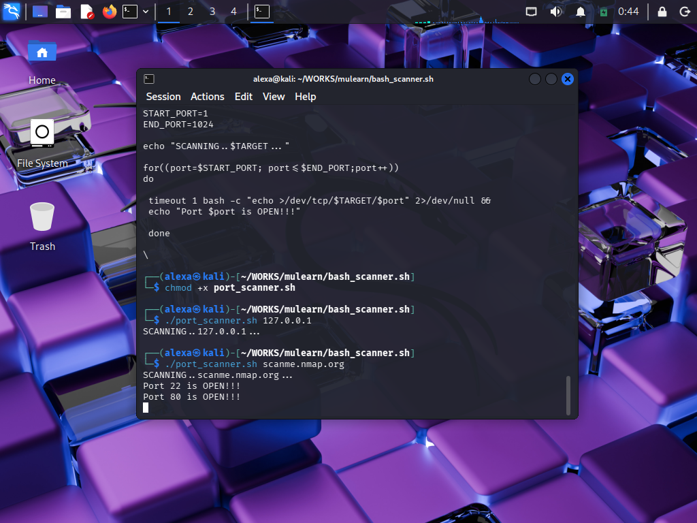

# Bash Port Scanner

## Project Overview

This project is a simple TCP port scanner developed using Bash scripting.

The scanner checks open ports on a target system and helps understand:

* Networking basics
* TCP connections
* Port scanning
* Cybersecurity fundamentals
* Bash scripting

---

## Features

* Scans ports from 1–1024
* Detects open TCP ports
* Lightweight and beginner-friendly
* Works on Linux/Kali Linux

---

## How to Run

### Give Execute Permission

```bash id="yw18vd"
chmod +x port_scanner.sh
```

### Scan localhost

```bash id="7zwlkf"
./port_scanner.sh 127.0.0.1
```

### Scan public test server

```bash id="l8ccbo"
./port_scanner.sh scanme.nmap.org
```

---

## Example Output

```text id="jlwmvb"
SCANNING..scanme.nmap.org...

Port 22 is OPEN!!!
Port 80 is OPEN!!!
```

---

## Output

```markdown id="9kj2xp"

```

---

## Port Information

| Port | Service |
| ---- | ------- |
| 22   | SSH     |
| 80   | HTTP    |
| 443  | HTTPS   |

---

## Technologies Used

* Bash Shell
* Linux / Kali Linux
* TCP Networking

---

